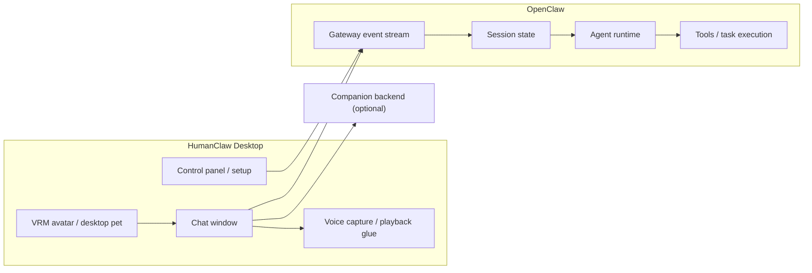

<div align="center">
  <h1>HumanClaw</h1>
  <p><strong>Desktop pet frontend + OpenClaw assistant bridge for Windows.</strong></p>
  <p>HumanClaw keeps the avatar, tray, chat window, and desktop interaction in the foreground, while OpenClaw handles sessions, agent runs, tool execution, and long-running work in the background.</p>
  <p>
    <a href="README.md">English</a> ·
    <a href="README.zh-CN.md">简体中文</a> ·
    <a href="README.ja.md">日本語</a>
  </p>
</div>

---


## What This Repository Ships

This repository now contains two related deliverables:

1. **HumanClaw desktop app**
   - Transparent VRM desktop pet window
   - Separate chat window
   - Control panel and setup wizard
   - Companion backend mode or local OpenClaw mode
   - Local voice input / voice output glue for the desktop experience

2. **OpenClaw Runtime installer**
   - A standalone Windows installer / portable package for the OpenClaw runtime bundle used by HumanClaw
   - Lives under [`openclaw-installer/`](./openclaw-installer)
   - Build target only; this repo does **not** vendor the full upstream OpenClaw source tree

If you only want a desktop companion, HumanClaw can run against the companion backend.  
If you want assistant workflows, HumanClaw can connect to a locally running OpenClaw Gateway.

## Product Positioning



## Runtime Modes

HumanClaw currently supports two backend modes:

- **`companion-service`**
  - The desktop pet talks to the companion backend
  - Best for companionship, lightweight conversation, and non-OpenClaw setups

- **`openclaw-local`**
  - The desktop pet connects to a local OpenClaw Gateway
  - OpenClaw owns sessions, event streams, tool execution, and task orchestration

Important boundary:

- HumanClaw is the desktop shell
- OpenClaw is the assistant runtime
- HumanClaw does not replace the OpenClaw Gateway or agent system

## Key Capabilities

- Frameless transparent desktop pet window
- Separate chat window synchronized with the pet runtime
- Three.js + `@pixiv/three-vrm` avatar rendering
- Control panel for backend mode, camera, voice, and Gateway target
- Setup wizard for first-run configuration
- Local desktop ASR path:
  browser microphone capture -> Electron IPC -> Python worker
- Optional local OpenClaw Gateway bridge from the Electron main process
- Windows packaging for both the desktop app and the OpenClaw runtime installer

## Quick Start

### 1. Install dependencies

```bash
pnpm install
python -m venv .venv
.venv\Scripts\activate
pip install -r requirements.txt
```

### 2. Run HumanClaw in desktop development mode

```bash
pnpm desktop:dev
```

### 3. Run the packaged desktop app locally

```bash
pnpm desktop:start
```

### 4. Connect HumanClaw to a local OpenClaw Gateway

```bash
openclaw gateway --profile source-dev
set AIGRIL_OPENCLAW_GATEWAY_URL=ws://127.0.0.1:19011
pnpm exec electron .
```

### 5. Build Windows desktop packages

```bash
pnpm desktop:package
```

### 6. Build the standalone OpenClaw Runtime installer

```bash
pnpm openclaw:prepare-runtime
pnpm openclaw:package-installer
```

This produces artifacts such as:

- `HumanClaw-<Edition>-Setup-<version>-win-x64.exe`
- `release/win-unpacked/HumanClaw.exe`
- `OpenClaw-Runtime-Setup-<version>-win-x64.exe`
- `OpenClaw-Runtime-Portable-<version>-win-x64.exe`

## Environment Variables

Required for the companion backend path:

```env
LLM_API_KEY=your_llm_api_key
```

Optional bridge variables:

```env
AIGRIL_OPENCLAW_GATEWAY_URL=ws://127.0.0.1:19011
AIGRIL_OPENCLAW_HOME=F:\HumanClaw\Runtime\OpenClawHome
AIGRIL_OPENCLAW_REPO=F:\path\to\your\openclaw-source
```

Compatibility note: existing `AIGRIL_*` environment variables and `aigril:*` IPC channels are intentionally preserved during the split from AIGril, so the desktop bridge stays stable while the product boundary is being cleaned up.

## Filesystem Layout

The desktop app resolves install and runtime folders from the selected workspace / install drive.  
In this repository the examples commonly resolve to:

```text
F:\HumanClaw\Applications\...
F:\HumanClaw\Runtime\...
F:\HumanClaw\VM\...
```

But the layout code is drive-aware rather than hard-pinned to a single disk. The relevant logic lives in [`electron/fs-layout.cjs`](./electron/fs-layout.cjs).

## Repository Layout

```text
backend/             FastAPI companion backend and TTS endpoints
electron/            Electron main process, preload bridge, desktop state, OpenClaw bridge
openclaw-installer/  Standalone OpenClaw Runtime installer shell
src/                 Avatar runtime, chat runtime, control/setup frontends
Resources/           VRM model and VRMA animation assets
scripts/             Packaging and static-build helper scripts
examples/            Small developer examples
```

## OpenClaw Runtime Packaging

The OpenClaw-related part of this repository is a runtime packaging and launcher layer, not the full upstream OpenClaw source code.  

See [`openclaw-installer/README.md`](./openclaw-installer/README.md) for:

- what the runtime installer packages
- how the bundle is prepared
- how it is expected to be used with HumanClaw

## Current Direction

The current product direction is:

- keep **HumanClaw** focused on the desktop pet, avatar, voice, and interaction surface
- keep **OpenClaw** focused on sessions, tool use, and engineering-task execution
- make the connection between the two explicit, lightweight, and replaceable
