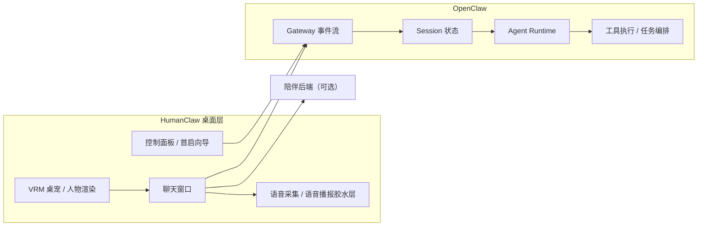

<div align="center">
  <h1>HumanClaw</h1>
  <p><strong>桌宠前端 + OpenClaw 助手桥接层。</strong></p>
  <p>HumanClaw 负责 3D 虚拟人、托盘、聊天窗和桌面交互；OpenClaw 负责会话、Agent、工具调用和长任务执行。前台是桌宠，后台是助手。</p>
  <p>
    <a href="README.md">English</a> ·
    <a href="README.zh-CN.md">简体中文</a> ·
    <a href="README.ja.md">日本語</a>
  </p>
</div>

---

## 这个仓库现在包含什么

这个仓库现在同时承载两条产品线：

1. **HumanClaw 桌面应用**
   - 透明桌宠窗口
   - 独立聊天窗口
   - 控制面板和首启向导
   - 支持陪伴后端或本地 OpenClaw
   - 负责桌面语音交互体验

2. **OpenClaw Runtime 安装器**
   - 给 HumanClaw 配套的本地 OpenClaw Runtime 安装包 / 便携包
   - 代码在 [`openclaw-installer/`](./openclaw-installer)
   - 这里只做运行时打包与启动壳，**不包含**完整上游 OpenClaw 源码仓库

也就是说，这个仓库不是“把 OpenClaw 整个塞进来”，而是把 **HumanClaw 前端** 和 **OpenClaw 本地运行时的打包接入层** 放在一起维护。

## 产品定位



## 运行模式

HumanClaw 现在支持两种后端模式：

- **`companion-service`**
  - 走陪伴后端
  - 更偏聊天、陪伴、轻交互

- **`openclaw-local`**
  - 连接本地 OpenClaw Gateway
  - 由 OpenClaw 负责 session、事件流、工具调用和任务执行

边界要点：

- HumanClaw 是桌面壳
- OpenClaw 是助手运行时
- HumanClaw 不是 OpenClaw Gateway / Agent 系统的替代品

## 当前能力

- 无边框透明桌宠窗口
- 与桌宠同步的独立聊天窗口
- 基于 Three.js 和 `@pixiv/three-vrm` 的 VRM 虚拟人渲染
- 控制面板：后端模式、镜头参数、语音开关、Gateway 地址
- 首启向导
- 本地语音链路：
  浏览器录音 -> Electron IPC -> Python ASR Worker
- 可选接入本地 OpenClaw Gateway
- Windows 安装包：桌宠应用 + OpenClaw Runtime 安装器

## 快速开始

### 1. 安装依赖

```bash
pnpm install
python -m venv .venv
.venv\Scripts\activate
pip install -r requirements.txt
```

### 2. 启动桌面开发模式

```bash
pnpm desktop:dev
```

### 3. 本地直接运行桌宠

```bash
pnpm desktop:start
```

### 4. 接本机 OpenClaw

```bash
openclaw gateway --profile source-dev
set AIGRIL_OPENCLAW_GATEWAY_URL=ws://127.0.0.1:19011
pnpm exec electron .
```

### 5. 打桌宠安装包

```bash
pnpm desktop:package
```

### 6. 打 OpenClaw Runtime 安装包

```bash
pnpm openclaw:prepare-runtime
pnpm openclaw:package-installer
```

生成产物包括：

- `HumanClaw-<Edition>-Setup-<version>-win-x64.exe`
- `release/win-unpacked/HumanClaw.exe`
- `OpenClaw-Runtime-Setup-<version>-win-x64.exe`
- `OpenClaw-Runtime-Portable-<version>-win-x64.exe`

## 环境变量

陪伴后端至少需要：

```env
LLM_API_KEY=your_llm_api_key
```

可选桥接变量：

```env
AIGRIL_OPENCLAW_GATEWAY_URL=ws://127.0.0.1:19011
AIGRIL_OPENCLAW_HOME=F:\HumanClaw\Runtime\OpenClawHome
AIGRIL_OPENCLAW_REPO=F:\path\to\your\openclaw-source
```

兼容性说明：因为仓库是从 AIGril 拆出来的，所以现在仍保留 `AIGRIL_*` 环境变量和 `aigril:*` IPC 通道，目的是先保证链路稳定，再逐步清理命名。

## 目录与运行时布局

应用会根据所选安装盘 / 工作盘自动解析安装与运行时目录。  
在当前仓库和示例环境里，常见路径通常会落到：

```text
F:\HumanClaw\Applications\...
F:\HumanClaw\Runtime\...
F:\HumanClaw\VM\...
```

但逻辑上并不是死锁在 F 盘，具体实现见 [`electron/fs-layout.cjs`](./electron/fs-layout.cjs)。

## 仓库结构

```text
backend/             FastAPI 陪伴后端与 TTS 接口
electron/            Electron 主进程、预加载桥、桌宠状态、OpenClaw 桥接
openclaw-installer/  OpenClaw Runtime 安装器外壳
src/                 虚拟人运行时、聊天运行时、控制面板与首启向导前端
Resources/           VRM 模型与 VRMA 动作资源
scripts/             打包与静态构建辅助脚本
examples/            小型开发示例
```

## OpenClaw 这部分到底是什么

这个仓库里和 OpenClaw 相关的部分，定位是：

- 本地 Gateway 对接
- Runtime 打包
- 启动与安装器外壳

而不是完整的上游 OpenClaw 源码仓库。

更具体的说明见 [`openclaw-installer/README.md`](./openclaw-installer/README.md)。

## 当前方向

当前的整理方向很明确：

- **HumanClaw** 专注桌宠、人物、语音和桌面交互
- **OpenClaw** 专注会话、工具和工程任务执行
- 两者之间通过清晰的桥接层连接，而不是重新耦死成一个大杂烩
